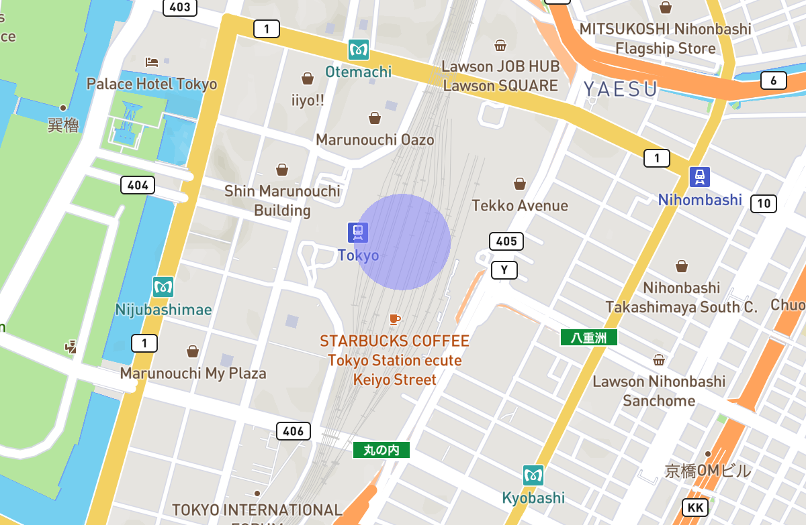

[English](./README.md) / 日本語

# maplibre-geo-circle-layer

[MapLibre GL JS](https://github.com/maplibre/maplibre-gl-js)のマップ上にシンプルな円を描画します。

## はじめる

### 事前要件

このライブラリはMapLibre GL JSバージョン5.xと組み合わせて使用する前提です。
(最新版の開発はv5.6.2で行いました。)

### インストール方法

以下のコマンドを実行してください。
```sh
npm install https://github.com/codemonger-io/maplibre-geo-circle-layer.git#v0.1.0
```

#### GitHub Packagesからインストールする

`main`ブランチにコミットがプッシュされるたびに、*開発者用パッケージ*がGitHub Packagesの管理するnpmレジストリにパブリッシュされます。
*開発者用パッケージ*のバージョンは次のリリースバージョンにハイフン(`-`)と短いコミットハッシュをつなげたものになります。例、`0.1.0-abc1234` (`abc1234`はパッケージをビルドするのに使ったコミット(*スナップショット*)の短いコミットハッシュ)。
*開発者用パッケージ*は[こちら](https://github.com/codemonger-io/maplibre-geo-circle-layer/pkgs/npm/maplibre-geo-circle-layer)にあります。

##### GitHubパーソナルアクセストークンの設定

*開発者用パッケージ*をインストールするには、最低限`read:packages`スコープの**クラシック**GitHubパーソナルアクセストークン(PAT)を設定する必要があります。
以下、簡単にPATの設定方法を紹介します。
より詳しくは[GitHubのドキュメント](https://docs.github.com/en/packages/working-with-a-github-packages-registry/working-with-the-npm-registry)をご参照ください。

PATが手に入ったら以下の内容の`.npmrc`ファイルをホームディレクトリに作成してください。(`$YOUR_GITHUB_PAT`はご自身のPATに置き換えてください。)

```
//npm.pkg.github.com/:_authToken=$YOUR_GITHUB_PAT
```

プロジェクトのルートディレクトリには以下の内容の`.npmrc`ファイルを作成してください。

```
@codemonger-io:registry=https://npm.pkg.github.com
```

これで以下のコマンドで*開発者用パッケージ*をインストールできます。

```sh
npm install @codemonger-io/maplibre-collision-boxes@0.1.0-abc1234
```

`abc1234`はインストールしたい*スナップショット*の短いコミットハッシュに置き換えてください。

### 使い方

以下のスニペットでは半透明の青色の円を東京駅周辺の半径100メートルに描画するカスタムレイヤー(`id="example-circle"`)を追加します。
```ts
import { GeoCircleLayer } from '@codemonger-io/maplibre-geo-circle-layer';
// map: maplibre-gl.Mapと仮定
map.addLayer(new GeoCircleLayer('example-circle', {
    radiusInMeters: 100,
    center: { lng: 139.7671, lat: 35.6812 },
    fill: { red: 0.5, green: 0.5, blue: 1, alpha: 0.5 },
}));
```

以下のようなものが表示されるはずです。


サンプルプロジェクトが[`example`フォルダ](./example/README.ja.md)にあります。

#### プロパティの更新

[`GeoCircleLayer`](./api-docs/markdown/maplibre-geo-circle-layer.geocirclelayer.md)の作成後に以下のプロパティを変更することができます。
- [`radiusInMeters`](./api-docs/markdown/maplibre-geo-circle-layer.geocirclelayer.radiusinmeters.md): 円の半径(メートル)
- [`center`](./api-docs/markdown/maplibre-geo-circle-layer.geocirclelayer.center.md): 円の中心
- [`fill`](./api-docs/markdown/maplibre-geo-circle-layer.geocirclelayer.fill.md): 円を塗りつぶす色
- [`numTriangles`](./api-docs/markdown/maplibre-geo-circle-layer.geocirclelayer.numtriangles.md): 円を近似する三角形の数

上記のプロパティのいずれかを更新すると、[`GeoCircleLayer`](./api-docs/markdown/maplibre-geo-circle-layer.geocirclelayer.md)はマップの再描画をトリガーします。

### APIドキュメント

[`api-docs/markdown`フォルダ](./api-docs/markdown/index.md)を参照ください(英語版のみ)。

## ライセンス

[MIT](./LICENSE)

## 開発

### Prerequisites

このライブラリをビルドするには[Node.js](https://nodejs.org/en/)のバージョン14以降が必要です。

### 依存関係のインストール

```sh
pnpm install --frozen-lockfile
```

### ライブラリのビルド

```sh
pnpm build
```

### APIドキュメントの生成

```sh
pnpm build:doc
```

これは`pnpm build`も実行します。

### 型チェックの実行

ライブラリをビルドすることなく型チェックを実行することができます。

```sh
pnpm type-check
```

### テストを実行

```sh
pnpm test
```

### GitHubワークフロー

`main`ブランチに対してPull RequestもしくはPushが行われると、ターゲットをビルドして検証する[GitHub Actions](https://github.com/features/actions)が開始します。

## このライブラリの代替

### 組み込みのCircleレイヤー

MapLibre GL JSには[組み込みのCircleレイヤー](https://maplibre.org/maplibre-style-spec/layers/#circle)があります。
レイヤー上に複数の円を描画することができますが、半径はピクセル(スクリーンユニット)で指定しなければなりません。
なので、地理的なエリアを囲む円を描画するのには適していません。

### maplibre-gl-draw-circle

[`maplibre-gl-draw-circle`](https://github.com/aws-amplify/maplibre-gl-draw-circle)は`maplibre-geo-circle-layer`よりも多くの機能を提供しています。
例えば、`maplibre-gl-circle`はオプションで円のインタラクティブな編集が可能です。
単純さで`maplibre-geo-circle-layer`を好まれる方もいらっしゃるかもしれません。